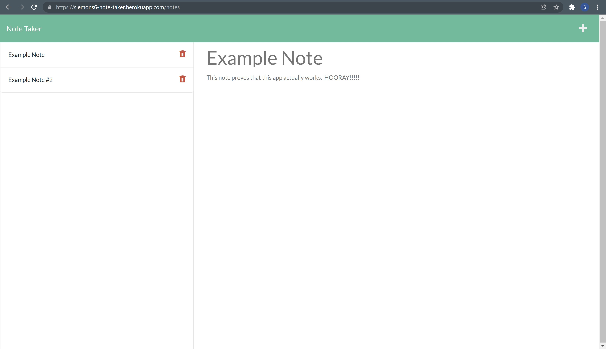

# Note Taker 

## Purpose:
A app that uses Express.js to write and store notes.

## Built With:
* HTML 
* CSS 
* JavaScript 
* Bootstrap
* FontAwesome
* Node.js
* Express.js

## Website: 

GitHub: https://github.com/SLemons6/note-taker  
Heroku: https://slemons6-note-taker.herokuapp.com/

# Credit: 
Created by Shayne Lemons